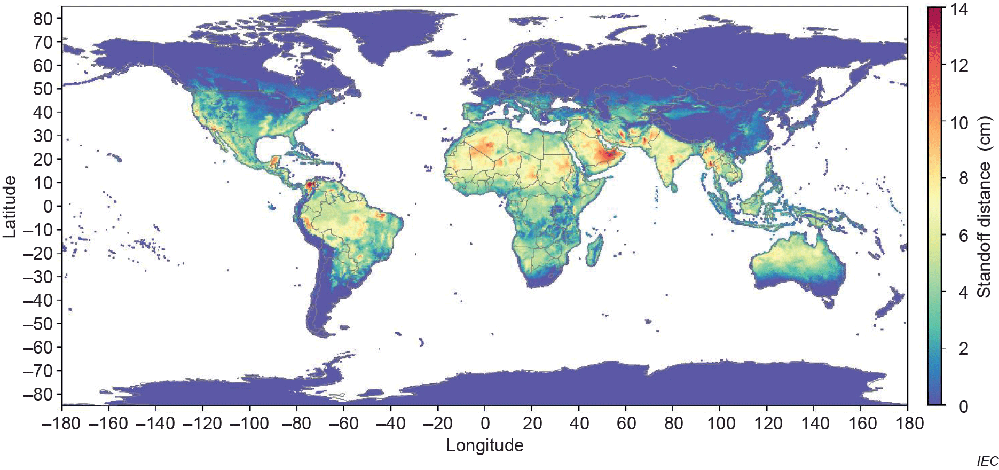

# Summary

PVDeg is an open-source Python package for modeling photovoltaic (PV) degradation, developed at the National Laboratory of the Rockies (NLR), previously known as National Renewable Energy Laboratory (NREL), and supported by the Durable Module Materials (DuraMAT) consortium. It provides modular functions, materials databases, and calculation workflows for simulating degradation mechanisms (e.g., LeTID, hydrolysis, UV exposure) using weather data from the National Solar Radiation Database (NSRDB) and the Photovoltaic Geographical Information System (PVGIS).  By integrating Monte Carlo uncertainty propagation and geospatial processing, PVDeg enables field-relevant predictions and uncertainty quantification of module reliability and lifetime.

PVDeg is developed openly on GitHub and releases are distributed via the Python Package Index (PyPi). The source code is freely available under the BSD 3-Clause license, and copyrighted by the Alliance for Sustainable Energy allowing permissive use with attribution. PVDeg follows best practices for open-source python software, with a robust testing framework across Python 3.x environments, semantic versioning, and supporting documentation available at pvdegradationtools.readthedocs.io.

As an open-source project, PVDeg welcomes community contributions through GitHub issues and pull requests that support improvements to the codebase, documentation, and material-property databases.

# Statement of Need

As PV deployment expands, especially into new and demanding operational environments, material degradation poses a challenge to the lifetime of PV modules. Modeling degradation is crucial for anticipating performance losses, guiding material selection, and enabling proactive maintenance strategies that extend the operational lifetime of PV modules in diverse environments. Currently, no open-source software combines physics-based degradation mechanism modeling with uncertainty quantification and geospatial scaling. This repository offers a powerful set of tools for PV reliability researchers, materials scientists, and engineers in both laboratories.

# State of the Field

Existing PV modeling tools such as pvlib-python [@pvlib] [@anderson2023pvlib] and SAM [@SAM] can simulate system energy yield, but not degradation. RdTools [@Deceglieetal2026] is a Python package that provides tools for PV degradation rate calculation. However, RdTools adopts a top-down approach whereby temporally-resolved system performance is known and degradation rates are extracted. In this case, the cause of degradation is not always clear. PVDeg addresses this gap with a bottom-up approach, which starts with the known physics of a degradation mechanism and evaluates the associated impact on the performance of a PV system. PVDeg provides modular degradation models, material databases, and uncertainty quantification workflows. PVDeg supports both research and industry use by automating degradation modeling, and enabling reproducible studies of module lifetime and performance worldwide. It also supports ongoing standardization work, including contributions to IEC TS 63126 [@IEC63126] through the geospatial mapping of optimal PV panel standoff distance. Defined as the distance between the module underside and the roof surface, the standoff distance is a critical characteristic of roof-mounted PV systems in particular, and must be optimized for cooling, fire safety, and structural clearance for safe and practical system mounting. The relevance of PVDeg for both research and industry renders it an important component of a growing ecosystem of open-source tools for solar energy, several of which are reviewed in Ref. [@Holmgren2018].

# Software Design
## Core Functions
The core API provides dedicated functions for calculating physical degradation mechanisms, accessing material properties and environmental stressors.  Examples include `pvdeg.humidity.module()` for moisture ingress modeling [@pickett2013hydrolysis], and `pvdeg.letid.calc_letid_outdoors()` for modeling light and elevated temperature induced degradation (LeTID) [@karas2022letidstudy; @repins2023longterm]. These functions rely on standardized environmental stressors such as temperature, irradiance, and humidity, and can be chained to produce lifetime predictions under realistic field conditions.

## Scenario Class
To simplify complex workflows, PVDeg wraps its core functions into a ``Scenario`` class that defines locations, module configurations, and degradation mechanisms. This enables user-friendly workflows, simplifying the setup and execution of complex multi-parameter degradation studies. This layer provides an intuitive interface for multiple analyses of different degradation modes climates, and configurations. Tutorials in Jupyter notebooks and hosted examples on *Read the Docs* demonstrate full end-to-end analyses.

## Geospatial Analysis
The geospatial analysis layer enables large-scale spatial analyses by automatically distributing degradation calculations across geographic regions using parallel processing and advanced data structures. It integrates environmental data from NSRDB and PVGIS and automates sampling across latitude-longitude grids to produce maps, such as standoff distance distribution used in IEC TS 63126 compliance studies [@IEC63126]. The geospatial layer includes specialized visualization functions for mapping results and supports both uniform and stochastic spatial sampling strategies to balance computational efficiency with geographic coverage. Parallelization routines are compatible with NREL's open-source *GeoGridFusion* framework [@ford2025geogridfusion; @Tobin2025geogridfusion], allowing users to down-select meteorological datasets efficiently and strategically, and execute computations without high-performance computing access. This capability supports national- and global-scale analyses of degradation phenomena.

## Monte Carlo Framework
Laboratory-to-field extrapolation carries significant uncertainty in kinetic parameters. PVDeg’s Monte Carlo engine samples parameter distributions and their correlations to generate thousands of realizations, producing confidence intervals on degradation rates rather than single deterministic values. This capability, described in [@springer2022futureproofing], can help quantify uncertainty in complex and non-linear module lifetime predictions, and identify which parameters most strongly affect reliability risk.

## Tutorials and Tools
The tutorials and tools component of PVDeg consists of a comprehensive suite of Jupyter notebooks that demonstrate practical workflows for modeling PV degradation. These notebooks cover core degradation mechanisms, scenario setup, geospatial analysis, and uncertainty quantification, providing step-by-step guidance for both new and advanced users. Each tutorial is designed to be interactive and reproducible, enabling users to explore real-world datasets, customize parameters, and visualize results. The notebooks support comparative studies and integration with external meteorological data sources such as NSRDB and PVGIS. By leveraging these notebooks, users can efficiently learn, apply, and extend PVDeg’s capabilities for research and industry applications. These tools make many aspects of PVDeg accessible to novice Python programmers whose research focus is on the measurement of laboratory-based acceleration factors.

## Open datasets
A growing component of PVDeg is its compilation of community-driven open datasets for PV degradation modeling. These databases include curated degradation parameters and material property data, such as kinetic coefficients for common degradation mechanisms, UV-albedo data, and permeation properties for materials (e.g., H$_2$O, O$_2$, acetic acid). The datasets are continuously expanded and updated, serving as a growing resource for users to access validated values for modeling and analysis. Users are encouraged to contribute their own data, enhancing the collective knowledge base and supporting reproducible research. The core PVDeg API also provides users with a means to seamlessly query these datasets and use them in their own modeling workflows, analysis, and investigations. The development and maintenance of these degradation databases and associated API calls also supports reproducible, reliable, and field-relevant degradation modeling for the PV community.

# Research Impact Statement
Since its first release as PV Degradation Tools [@Holsapple2020pvdegtools], PVDeg has been adopted in multiple studies across the PV reliability community:
* Thermal Stability and IEC TS 63126 Compliance: Used to calculate effective standoff distances and generate public maps supporting the IEC TS 63126 standard [@IEC63126].
* Light and Elevated Temperature Induced Degradation (LeTID): Integrated into the international interlaboratory comparison study of LeTID effects in crystalline-silicon modules [@karas2022letidstudy] and follow-up analyses of field-aged arrays [@repins2023longterm; @karas2024letid].
* Geospatial Performance Modeling: Coupled with GeoGridFusion [@ford2025geogridfusion] to streamline weather-data storage and spatial queries for large-scale degradation simulations.
* Agrivoltaics and System-Level Modeling: Combined with PySAM [@SAM] to assess degradation-driven yield losses and ground-irradiance patterns in dual-use agrivoltaic systems. [@OvaittPuertoRico2023]
* Material-Property Parameterization: Leveraged in studies of UV-induced polymer degradation [@kempe2023uvstress] and moisture-related failures in encapsulants and backsheets [@coyle2011cigs].

These applications highlight PVDeg’s versatility as the “PV Library of degradation phenomena” — an open, community-driven platform linking materials science, environmental modeling, and field performance.

# Ongoing Development
Version 0.7.1 is the latest stable release, incorporating support for NSRDB PSM v4 weather data and a major restructuring of the Jupyter notebook tutorials for improved usability and clarity.

DuraMAT-funded projects will expand the degradation and material parameter databases using literature searches driven by large language models. In addition, the Scenario class is being developed to support multi-material modules and chained job dependencies, allowing coupled multiphysics modeling of interrelated degradation and transport mechanisms within a single reproducible workflow. This will mitigate the need for users to design and execute multiple individiual Scenarios for different degradation pathways and materials.

# AI usage disclosure
Generative AI was used to support the creation of docstrings in the software, and changelogs published in release notes. No generative AI tools were used in the writing of this manuscript or preparation of supporting materials. All outputs created using generative AI were thoroughly vetted by the contributor(s) for accuracy.

# Acknowledgements
We acknowledge all code, documentation, and discussion contributors to the PVDeg project, in particular Derek Holsapple for building the foundational Python code, and Aidan Wesley for helping with data acquisition.

This work was authored by the National Laboratory of the Rockies for the U.S. Department of Energy (DOE) under Contract No. DE-AC36-08GO28308. Funding provided as part of the Durable Modules Materials Consortium (DuraMAT), an Energy Materials Network Consortium funded by the U.S. Department of Energy, Office of Energy Efficiency and Renewable Energy, Solar Energy Technologies Office Agreement Number 32509. The research was performed using computational resources sponsored by the Department of Energy's Office of Energy Efficiency and Renewable Energy and located at the National Laboratory of the Rockies. The views expressed in the article do not necessarily represent the views of the DOE or the U.S. Government. The U.S. Government retains and the publisher, by accepting the article for publication, acknowledges that the U.S. Government retains a nonexclusive, paid-up, irrevocable, worldwide license to publish or reproduce the published form of this work, or allow others to do so, for U.S. Government purposes.

# References
